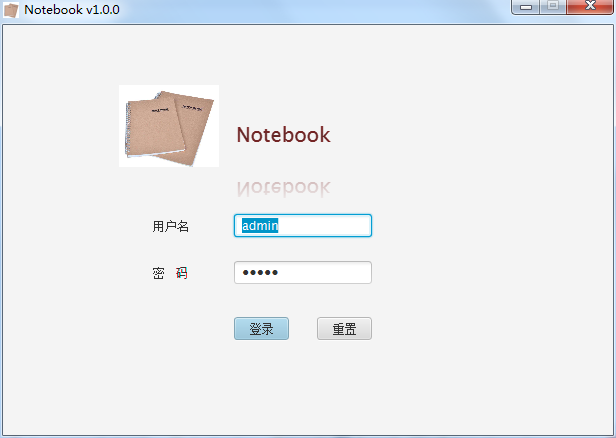
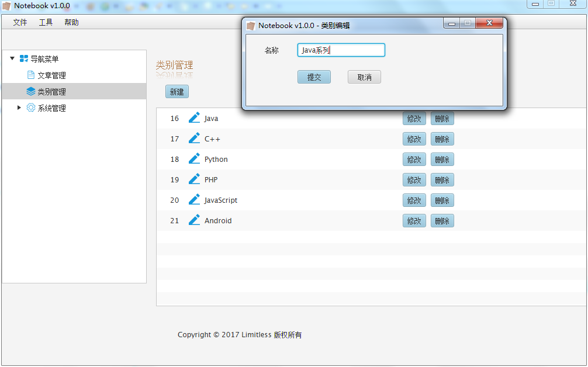
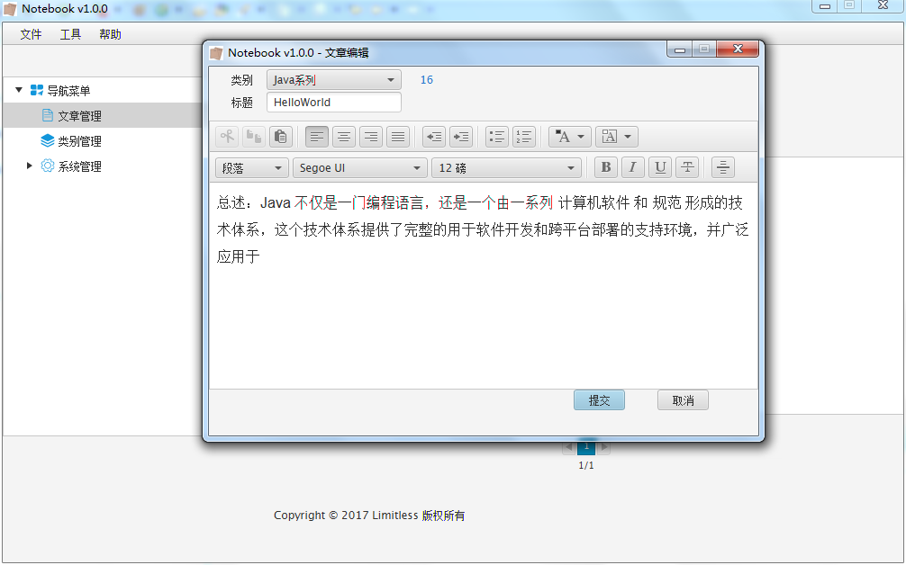
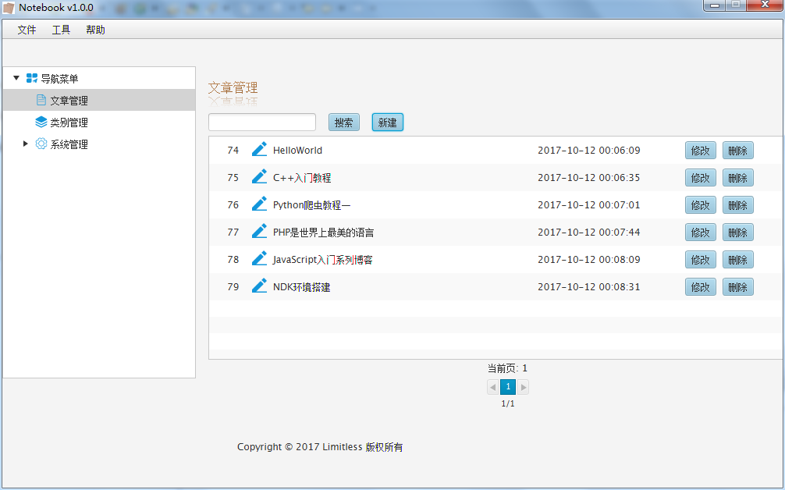

# Notebook
Notebook 一款JavaFX编写的博客管理系统，

## 功能介绍
提供文章的管理：对文章以及类别进行添加、修改、删除、查找等操作。

Notebook的数据存储在notebook.db文件中，位于软件的根目录下。

为了便捷性，软件使用Sqlite作为数据库，支持发布和同步功能。其中

使用GitHub(Oschina等)作为云端仓库，所以需要创建一个专供Notebook DB保存的

Git仓库即可（该仓库 -本地和远端- 已建立关联），然后仅需在Notebook中设置本地

仓库的路径和远端DB文件(encrypt.db)的URL下载链接即可《发布》与《同步》功能。

发布=> 使用指定秘钥加密notebook.db 并自动git.push到指定GitHub仓库中（JGit）。

同步=> 下载指定URL的encrypt.db 并解密数据，生成临时文件temp.db，移动temp.db替换Notebook根目录下的notebook.db文件。

----------------------------------------------------

## 下载
[Notebook 百度云](http://pan.baidu.com/s/1c2q7BqS)

## 部分截图

## License
    Copyright 2017 coding-dream

    Licensed under the Apache License, Version 2.0 (the "License");
    you may not use this file except in compliance with the License.
    You may obtain a copy of the License at

        http://www.apache.org/licenses/LICENSE-2.0

    Unless required by applicable law or agreed to in writing, software
    distributed under the License is distributed on an "AS IS" BASIS,
    WITHOUT WARRANTIES OR CONDITIONS OF ANY KIND, either express or implied.
    See the License for the specific language governing permissions and
    limitations under the License.
